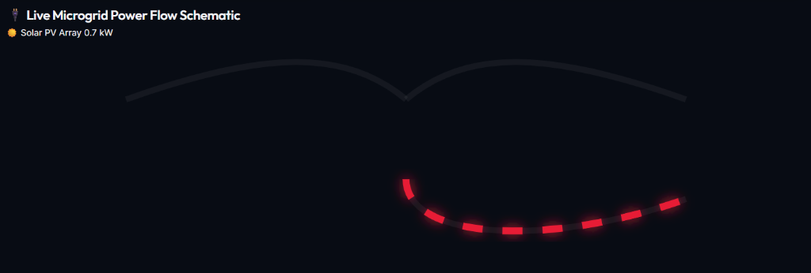

# <div align="center">⚡ Stochastic Smart Grid Load Decision Agent</div>

<p align="center">
  <a href="https://github.com/tejaswin-amara/Smart-Grid-Load-Decision-Agent/actions"></a>
  <a href="https://www.python.org/"></a>
  <a href="https://github.com/tejaswin-amara/Smart-Grid-Load-Decision-Agent/blob/main/LICENSE"></a>
  <a href="https://stable-baselines3.readthedocs.io/"></a>
  <a href="https://tejaswin-amara.github.io/Smart-Grid-Load-Decision-Agent/"></a>
</p>

<p align="center">
  <strong>A production-grade, physics-informed Deep Reinforcement Learning microgrid control system. Utilizing Soft Actor-Critic (SAC) to dynamically balance multi-objective thermal and financial trade-offs in continuous action spaces under uncertainty.</strong>
</p>

<p align="center">
  <a href="https://tejaswin-amara.github.io/Smart-Grid-Load-Decision-Agent/">
    
  </a>
</p>

<br/>

---

> [!NOTE]
> ### 🎓 Academic Metadata
> - **Author:** Tejaswin Amara
> - **Program:** CSIT, KLH University (Bachupally Campus)
> - **Academic Standing:** I year III semester
> - **Course:** Computational Foundations for Artificial Intelligence
> - **Roll Number:** 2520090104

---

## 📖 Executive Summary

The **Stochastic Smart Grid Load Decision Agent** is a deep reinforcement learning physics engine designed to optimize continuous power dispatch within a simulated microgrid. Using a state-of-the-art **Soft Actor-Critic (SAC)** algorithm, this agent autonomously learns to balance battery state-of-charge, maximize financial arbitrage, utilize renewable solar energy, and minimize dynamic thermal degradation. 

By modeling volatile electricity markets and solar generation as Autoregressive AR(1) stochastic processes, the project successfully bridges deep learning theory with highly constrained thermodynamic edge environments.

---

## 🏗️ Key Architectural Innovations

| Innovation | Core Breakthrough | Key Benefit |
| :--- | :--- | :--- |
| **🔮 8D Lookahead Forecast** | Expands the state-space tensor to include price predictions at $t+1, t+2, t+3, \text{ and } t+4$ hours. | Allows the actor network to predict peak generation windows and optimize deep-discharge cycles preemptively. |
| **📈 Stochastic AR(1) Modeling** | Simulates electricity pricing and solar irradiance as mean-reverting Autoregressive random shock transitions. | Provides mathematically rigorous uncertainty boundaries for continuous action space stability. |
| **💾 Production Serialization** | Stable-Baselines3 `.zip` serialization with `VecNormalize` checkpoint support. | Enables portable model loading and deterministic inference with pre-fitted observation normalization statistics. |
| **⚡ Serverless Edge Wasm** | Compiles and loads the entire data science stack client-side natively inside the browser via `stlite`. | Guarantees absolute user privacy, zero host-side server latency, and infinite scaling capabilities. |

---

## 🎨 Visual & Interactive Features (UI/UX Parity)

Both the Python **Streamlit dashboard** (`app.py`) and the serverless **WebAssembly demo** (`index.html`) share a fully-aligned, highly polished UI/UX design:

| Feature | Core Functionality | Purpose for Layperson |
| :--- | :--- | :--- |
| **🏡 1-Click Presets** | Pre-configured setups for *Home Battery*, *Pricing Crisis*, and *Solar Peak*. | Instantly evaluates microgrid models under recognizable scenarios without manual configuration. |
| **🎓 Dual-Mode Toggle** | Instantly switches the entire dashboard between **Simple View** and **Academic View**. | Translates complex RL terms (State of Charge, Arbitrage, Volatility Risk) into natural natural language terms. |
| **🎮 Play the Simulator** | Turns control over to the user for a 48-hour step-by-step microgrid trading game. | Provides a direct head-to-head score comparison evaluating how manual trading fares against the Soft Actor-Critic agent. |
| **🔌 Reactive SVG Flow** | A real-time vector schematic depicting active current paths (solar, grid import/export, charge/discharge). | Visually demonstrates physical battery state transitions and active power flow dynamics. |

---

## 📂 Repository Structure

Below is the layout of the project, demonstrating the clean decoupling of deep learning environments, training workflows, and deployment frameworks:

```ascii
└── Smart-Grid-Load-Decision-Agent/
    ├── assets/                  # High-resolution screenshots and media assets
    │   └── schematic.png        # Live microgrid flow schematic visual asset
    ├── best_grid_model/         # Production serialization outputs
    │   ├── best_model.zip       # Stable-Baselines3 serialized SAC policy network
    │   └── final_model.zip      # Final trained model with VecNormalize checkpoint
    ├── app.py                   # Streamlit interactive decision-agent application
    ├── environments.py          # Physics-informed Gymnasium microgrid MDP simulation
    ├── train.py                 # Stable-Baselines3 Soft Actor-Critic training loop
    ├── index.html               # Main portfolio landing page with interactive web-loader
    ├── styles.css               # Premium CSS styles for the web environment
    ├── script.js                # Client-side ES6 simulation engine with Plotly visualization
    ├── requirements.txt         # Project package requirements list
    └── README.md                # World-class documentation (this file)
```

---

## 📈 Stochastic AR(1) Noise Processes

To simulate the volatility of real-world energy grids, electricity pricing and solar irradiance are modeled as mean-reverting Autoregressive AR(1) processes. The forward transition equation for the pricing grid relies on dynamic drift decay and stochastic shocks:

<div align="center">

$$
p_{t+1} = \mu_p + \phi_p(p_t - \mu_p) + \epsilon^p_t
$$

</div>

Where the transition variables are defined as:
* **$p_{t+1}$**: Represents the electricity price at the next hourly time step $t+1$.
* **$\mu_p$**: The deterministic sinusoidal time-of-day baseline representing market rhythms.
* **$\phi_p$**: The mean-reverting autocorrelation coefficient ($0 < \phi_p < 1$).
* **$p_t$**: The electricity price observed at the current time step $t$.
* **$\epsilon^p_t \sim \mathcal{N}(0, \sigma^2)$**: Represents real-time stochastic grid shocks (Gaussian standard normal noise with variance $\sigma^2$).

---

## 📐 Mathematical Reward Shaping

The SAC agent optimizes a composite, physics-informed multi-objective reward function formulated to balance immediate financial gains with long-term infrastructure health:

<div align="center">

$$
R_t = \underbrace{-\left(\frac{P_t \cdot \rho_t \cdot \Delta t}{1000}\right) \cdot w_{\text{arb}}}_{\text{Arbitrage Profit}} + \underbrace{\max(0, -P_t \cdot S_t \cdot w_{\text{green}})}_{\text{Green Bonus}} - \underbrace{|P_t| \cdot \Delta t \cdot C_{\text{deg}} \cdot (1 + \lambda(T_{\text{cell}} - T_{\text{nom}})^2) \cdot w_{\text{wear}}}_{\text{Dynamic Thermal Wear Penalty}} - \underbrace{w_{\text{soc}} (SoC_t - 0.5)^2}_{\text{SoC Centering}}
$$

</div>

The composite components are categorized and structured as:
- 💰 **Financial Arbitrage (Profit)**:
  $$-\left(\frac{P_t \cdot \rho_t \cdot \Delta t}{1000}\right) \cdot w_{\text{arb}}$$
  Charges the battery when electricity price $\rho_t$ is negative or low, and discharges at premium pricing tiers.
- 🍃 **Green Bonus**:
  $$\max(0, -P_t \cdot S_t \cdot w_{\text{green}})$$
  Provides a positive reward for discharging ($P_t < 0$) when local solar generation ($S_t$) is abundant, incentivizing local zero-emission loop closures.
- 🌡️ **Dynamic Thermal Wear Penalty**:
  $$-|P_t| \cdot \Delta t \cdot C_{\text{deg}} \cdot (1 + \lambda(T_{\text{cell}} - T_{\text{nom}})^2) \cdot w_{\text{wear}}$$
  Models battery degradation as a non-linear function of battery temperature ($T_{\text{cell}}$) above a nominal threshold ($T_{\text{nom}}$) and charge intensity.
- 🎯 **State-of-Charge (SoC) Centering**:
  $$-w_{\text{soc}} (SoC_t - 0.5)^2$$
  Applies a mild continuous penalty for driving the battery to absolute extremes ($0\%$ or $100\%$), extending the battery's operational lifetime.

> [!IMPORTANT]
> The physical State of Charge ($SoC$) is bounded by a strict system invariant:
> $$SoC_t \in [0.0, 1.0] \quad \forall t$$
> Any actions attempting to push the battery past these limits are physically clipped by environment constraints (`np.clip`).

### 🔌 Dynamic Microgrid Power Flow Visualization

To visualize how the physical dynamics and mathematical boundaries ($P_t$, $S_t$, and $SoC$) act together in real-time under the trained model, the live system renders a dynamic power flow schematic:

<div align="center">
  
</div>

#### What the Visual Lines Represent:
*   **Solid Curved Vectors (Top)**: Model the active grid load pricing feed and raw photovoltaic solar array generation ($S_t$) capacity.
*   **Dashed Animated Flow (Bottom)**: Represents the continuous charging/discharging battery load flow ($P_t$). The animation speed dynamically scales with physical current throughput, and the color state indicates active charging (solar surplus/off-peak grid) vs discharging (peak arbitrage).
*   **Pulsing State-of-Charge (SoC) Indicators**: Track the physical energy boundaries to prevent overcharging or absolute deep discharge, matching the hard state invariants enforced mathematically in the Gymnasium environment loop.

---

## 🚀 Installation & Usage

To reproduce the training physics locally or expand upon the neural architecture:

> [!TIP]
> **Prerequisites:** Make sure Python 3.9+ is installed and configured on your system PATH before attempting local training. Running PyTorch with CUDA acceleration is highly recommended for faster training convergence.

```bash
# 1. Clone the repository
git clone https://github.com/tejaswin-amara/Smart-Grid-Load-Decision-Agent.git
cd Smart-Grid-Load-Decision-Agent

# 2. Install PyTorch and standard dependencies
pip install -r requirements.txt

# 3. Execute the SAC training loop and save the model
python train.py
```

---

## 🌐 Live Demonstration

Access the zero-latency, serverless interactive WebAssembly dashboard here:

👉 **[Launch Live Serverless Dashboard](https://tejaswin-amara.github.io/Smart-Grid-Load-Decision-Agent/)**

> [!IMPORTANT]
> **WebAssembly Serverless Architecture:** The entire interactive experience is executing natively on your CPU in the browser using Wasm. Plotly graphs, Gymnasium model transitions, and ONNX runtime are fully client-side (no backend required!).

---

## 📄 License & Footer

### ⚖️ License
This project is licensed under the **MIT License** - see the [LICENSE](https://github.com/tejaswin-amara/Smart-Grid-Load-Decision-Agent/blob/main/LICENSE) file for details.

### 🤝 Acknowledgments
* **Department of Computer Science & Information Technology (CSIT)**, KLH University (Bachupally Campus).
* **Course Instructor** for *Computational Foundations for Artificial Intelligence*, for architectural guidance on stochastic Markov Decision Processes.
* **Stable-Baselines3 & Gymnasium Maintainers** for providing robust baseline RL code patterns.

### 📬 Contact & Connect
* **Author:** Tejaswin Amara  
* **Academic Email:** [tejaswin.amara@gmail.com](mailto:tejaswin.amara@gmail.com)  
* **GitHub Profile:** [github.com/tejaswin-amara](https://github.com/tejaswin-amara)
